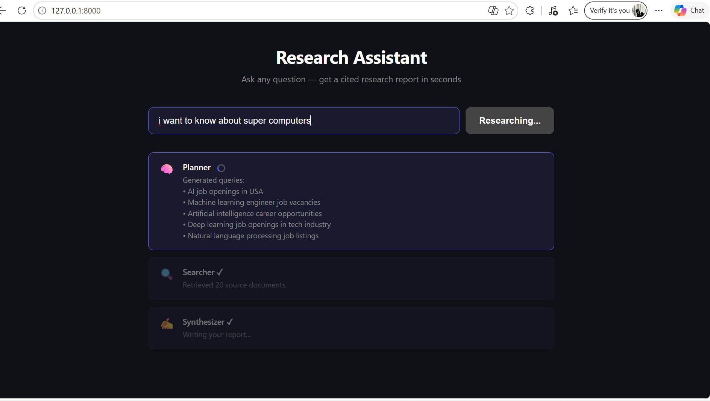
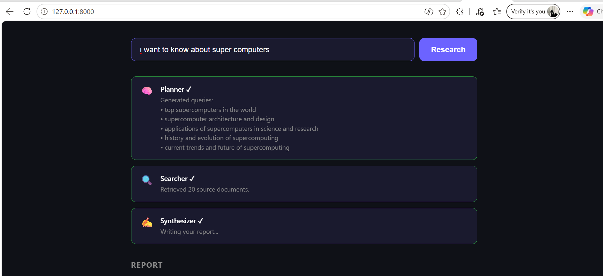
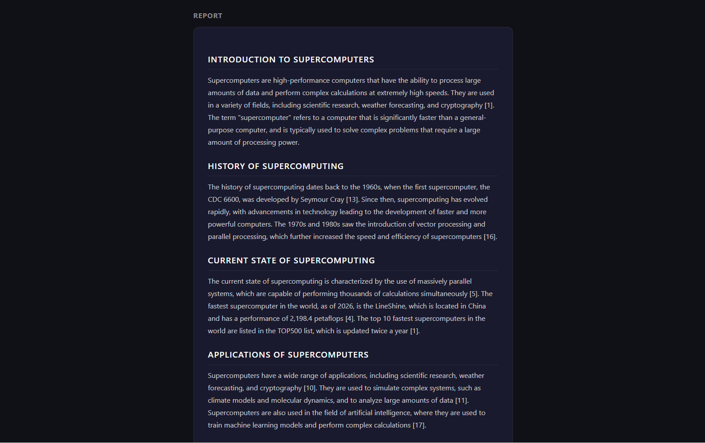

# Multi-Agent Research Assistant

A **RAG-based Multi-Agent Research Assistant** that takes any question, autonomously searches the live web, reads multiple sources, and returns a structured, cited markdown report — all in under 60 seconds.

> Built with LangGraph · Groq (Llama 3.3 70B) · Tavily · FastAPI

---

## Demo


*Type any question and watch each agent activate in real time*


*Planner → Searcher → Synthesizer — each step shows live progress*


*Full cited markdown report with headings, inline citations, and references*

---

## The Problem It Solves

When you want to research any topic today, you have two bad options:

**Option A — Do it manually:**
1. Open Google, search multiple times with different keywords
2. Open 10–20 tabs
3. Read each article
4. Cross-reference sources
5. Write your own summary with citations
6. ⏱️ Takes **30–60 minutes**

**Option B — Ask ChatGPT/Claude:**
- Answers from training data → can be **outdated**
- Sources are often **hallucinated** (made-up URLs)
- No access to **today's news or current events**

**Our Solution:**
- Searches the **live web** before generating any answer
- Every fact comes from a **real URL you can verify**
- Produces a **professional cited report** in under 60 seconds
- Never makes up sources — only uses what it actually found

---

## How It Works

```
User types a question
         │
         ▼
┌─────────────────────────────────────┐
│         PLANNER AGENT               │
│         (Groq / Llama 3.3 70B)      │
│                                     │
│  Reads the question and breaks it   │
│  into 3–5 focused search queries    │
│  targeting different angles         │
└──────────────┬──────────────────────┘
               │ ["query 1", "query 2", ...]
               ▼
┌─────────────────────────────────────┐
│         SEARCHER AGENT              │
│         (Tavily Search API)         │
│                                     │
│  Runs every query against the live  │
│  web. Fetches top 4 results per     │
│  query → up to 20 real sources      │
└──────────────┬──────────────────────┘
               │ [{title, url, content}, ...]
               ▼
┌─────────────────────────────────────┐
│       SYNTHESIZER AGENT             │
│       (Groq / Llama 3.3 70B)        │
│                                     │
│  Reads all 20 sources and writes    │
│  a structured markdown report with  │
│  [N] inline citations + References  │
└──────────────┬──────────────────────┘
               │
               ▼
      Cited Markdown Report
   streamed live to your browser
```

The three agents are orchestrated by **LangGraph** as a directed graph, sharing data through a typed `ResearchState` dictionary. Results stream to the browser in real time via **Server-Sent Events (SSE)** so you see each agent activate as it works.

---

## Tech Stack

| Technology | Role | Why |
|---|---|---|
| **LangGraph** | Orchestrates the 3 agents as a graph | Manages shared state, execution order, and makes the pipeline easy to extend |
| **Groq + Llama 3.3 70B** | AI brain for Planner & Synthesizer | Free tier, extremely fast inference |
| **Tavily API** | Live web search | Built for AI apps — returns clean text, not raw HTML |
| **FastAPI** | Python web server + API | Lightweight, async, native streaming support |
| **SSE (Server-Sent Events)** | Real-time progress streaming | Shows each agent activating live without page refresh |
| **Marked.js** | Markdown rendering in browser | Turns AI output into formatted HTML instantly |

---

## Core Concept: RAG (Retrieval Augmented Generation)

This project is built on the **RAG** pattern — the most important architecture in modern AI applications:

- **Retrieval** → Tavily fetches real documents from the live web
- **Augmented** → those documents are injected into the LLM's context
- **Generation** → Groq/Llama writes an answer grounded in those documents

| | Standard LLM | RAG (This Project) |
|---|---|---|
| Knowledge source | Training data (fixed cutoff) | Live web (always current) |
| Citations | Often hallucinated | Always real, verified URLs |
| Up to date | No | Yes |
| Verifiable | Hard | Every claim has a source |

This is the same architecture used by **Perplexity AI** (valued at $3B+).

---

## Project Structure

```
multi-agent-research-assistant/
│
├── agents/
│   ├── state.py          # Shared ResearchState TypedDict (contract between agents)
│   ├── planner.py        # Agent 1 — calls Groq to generate search queries
│   ├── searcher.py       # Agent 2 — calls Tavily API for each query
│   └── synthesizer.py    # Agent 3 — calls Groq to write the final report
│
├── graph.py              # LangGraph pipeline: wires the 3 nodes together
├── server.py             # FastAPI server with SSE streaming endpoint
├── main.py               # CLI version (run from terminal)
├── static/
│   └── index.html        # Frontend UI (HTML + CSS + Vanilla JS)
├── requirements.txt      # Python dependencies
├── package.json          # npm scripts for easy dev startup
└── .env                  # API keys (never committed)
```

### Key file: `agents/state.py`

```python
class ResearchState(TypedDict):
    question: str          # set by the user
    search_queries: list   # set by the Planner
    search_results: list   # set by the Searcher
    report: str            # set by the Synthesizer
```

This single shared dictionary is the "contract" between all agents. Each node reads what it needs and writes its output back. LangGraph handles merging automatically.

### Key file: `graph.py`

```python
g.add_node("planner", planner_node)
g.add_node("searcher", searcher_node)
g.add_node("synthesizer", synthesizer_node)

g.set_entry_point("planner")
g.add_edge("planner", "searcher")
g.add_edge("searcher", "synthesizer")
g.add_edge("synthesizer", END)
```

Three lines of edges define the entire pipeline.

---

## Setup & Running

### Prerequisites
- Python 3.10+
- Node.js (for `npm run dev`)

### 1. Clone the repo

```bash
git clone https://github.com/adithyaraghavv/multi-agent-research-assistant
cd multi-agent-research-assistant
```

### 2. Install Python dependencies

```bash
pip install -r requirements.txt
```

### 3. Get your free API keys

| Key | Where to get it | Cost |
|---|---|---|
| `GROQ_API_KEY` | [console.groq.com](https://console.groq.com) | Free |
| `TAVILY_API_KEY` | [app.tavily.com](https://app.tavily.com) | Free (1000 searches/month) |

### 4. Create your `.env` file

```bash
cp .env.example .env
```

Edit `.env`:
```
GROQ_API_KEY=gsk_...
TAVILY_API_KEY=tvly-...
```

### 5. Start the app

```bash
npm run dev
```

Open your browser at **http://localhost:8000**

### CLI alternative

```bash
python main.py "What is the impact of AI on healthcare?"

# Save report to file
python main.py "Best practices for microservices in 2025" > report.md
```

---

## Example Questions to Try

```
What are the latest breakthroughs in fusion energy?
How is AI changing the software engineering job market?
What is the current state of quantum computing?
Best practices for microservices architecture in 2025?
What are the risks and opportunities in the EV battery market?
```

---

## Architecture Decisions

**Why multi-agent instead of one big prompt?**
Separating concerns into three specialized agents makes each step independently debuggable, testable, and replaceable. You can swap Tavily for a different search provider without touching the planner or synthesizer.

**Why LangGraph?**
LangGraph lets you define agent workflows as a typed graph with shared state — making it easy to add branching, loops, or retries later (e.g., retry search if results are poor quality).

**Why Groq?**
Groq's inference is significantly faster than most providers and has a generous free tier — ideal for a pipeline that calls the LLM twice per request.

**Why SSE over WebSockets?**
Server-Sent Events are one-directional (server → client) which is exactly what we need for streaming progress updates. Simpler than WebSockets with no extra library required.

---

## What's Next (Potential Extensions)

- **Follow-up questions** — maintain conversation context across multiple queries
- **Export options** — download report as PDF or Word document
- **Search depth control** — let users choose fast (5 sources) vs deep (30 sources)
- **Vector database caching** — store past research to avoid redundant API calls
- **Feedback loop** — Synthesizer requests additional searches if it detects gaps in the sources
